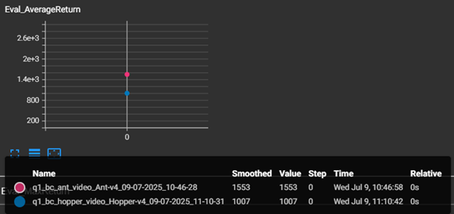
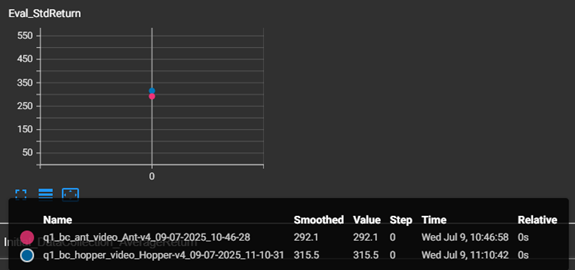
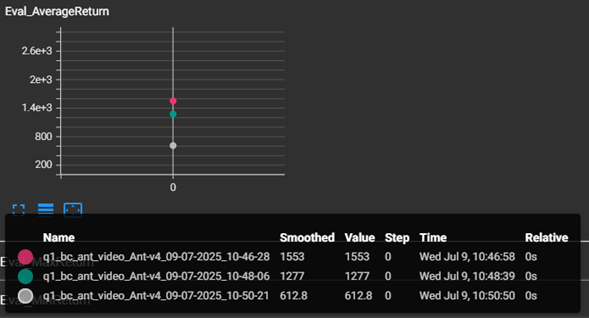
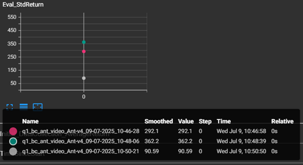
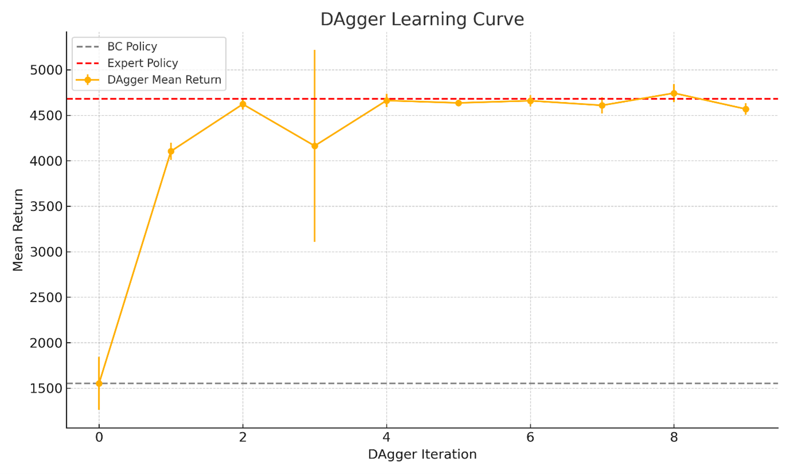
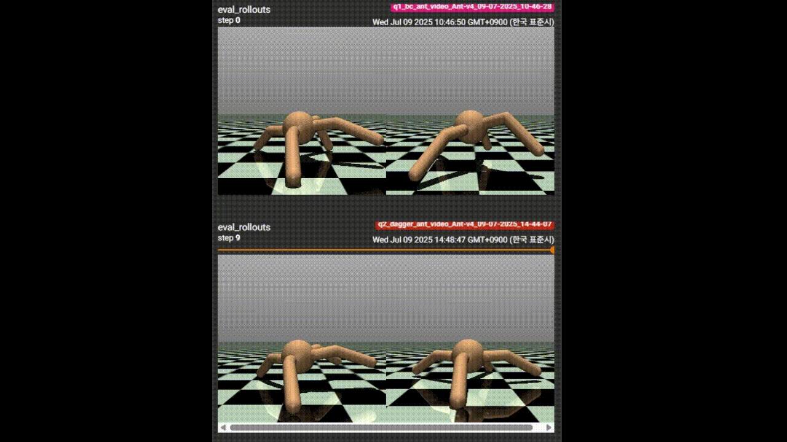

## Run the code


### 3.1 (Behavior Cloning)


Command for problem 3.1 (30% of expert performance):

```
python cs285/scripts/run_hw1.py \
--expert_policy_file cs285/policies/experts/Ant.pkl --env_name Ant-v4 
--exp_name bc_ant_video --n_iter 1 --expert_data cs285/expert_data/expert_data_Ant-v4.pkl 
--ep_len 1000 --eval_batch_size 5000 --video_log_freq 1 --n_layers 2 --size 64
```

Command for problem 3.1 (under 30% of expert performance):

```
python cs285/scripts/run_hw1.py 
--expert_policy_file cs285/policies/experts/Hopper.pkl --env_name Hopper-v4 
--exp_name bc_hopper_video --n_iter 1 --expert_data cs285/expert_data/expert_data_Hopper-v4.pkl 
--ep_len 1000 --eval_batch_size 5000 --video_log_freq 1 --n_layers 2 --size 64
```
Result of problem 3.1 (Ant-v4 vs Hopper-v4):





### 3.2 (Behavior Cloning)
Command for problem 3.2 (--n_layers 2 --size 64):

```
python cs285/scripts/run_hw1.py \
--expert_policy_file cs285/policies/experts/Ant.pkl --env_name Ant-v4 
--exp_name bc_ant_video --n_iter 1 --expert_data cs285/expert_data/expert_data_Ant-v4.pkl 
--ep_len 1000 --eval_batch_size 5000 --video_log_freq 1 --n_layers 2 --size 64
```
Command for problem 3.2 (--n_layers 4 --size 128):

```
python cs285/scripts/run_hw1.py \
--expert_policy_file cs285/policies/experts/Ant.pkl --env_name Ant-v4 
--exp_name bc_ant_video --n_iter 1 --expert_data cs285/expert_data/expert_data_Ant-v4.pkl 
--ep_len 1000 --eval_batch_size 5000 --video_log_freq 1 --n_layers 4 --size 128
```

Command for problem 3.2 (--n_layers 1 --size 32):

```
python cs285/scripts/run_hw1.py \
--expert_policy_file cs285/policies/experts/Ant.pkl --env_name Ant-v4 
--exp_name bc_ant_video --n_iter 1 --expert_data cs285/expert_data/expert_data_Ant-v4.pkl 
--ep_len 1000 --eval_batch_size 5000 --video_log_freq 1 --n_layers 1 --size 32
```


Result of problem 3.2
red => --n_layers 2 --size 64
green => --n_layers 4 --size 128
white => --n_layers 1 --size 32





### 4.2 (DAgger)

Command for problem 4.2 :

```
python cs285/scripts/run_hw1.py 
--expert_policy_file cs285/policies/experts/Ant.pkl --env_name Ant-v4 
--exp_name dagger_ant_video --n_iter 10 --do_dagger --expert_data cs285/expert_data/expert_data_Ant-v4.pkl 
--ep_len 1000 --eval_batch_size 5000 --video_log_freq -1 --n_layers 2 --size 64
```

Result of problem 4.2





## Visualization the saved tensorboard event file:

You can visualize your runs using tensorboard:
```
tensorboard --logdir data
```


