## Run the code


### 3 Policy Gradients


Command for problem 3

```
python cs285/scripts/run_hw2.py --env_name CartPole-v0 -n 100 -b 1000 \
--exp_name cartpole
python cs285/scripts/run_hw2.py --env_name CartPole-v0 -n 100 -b 1000 \
-rtg --exp_name cartpole_rtg
python cs285/scripts/run_hw2.py --env_name CartPole-v0 -n 100 -b 1000 \
-na --exp_name cartpole_na
python cs285/scripts/run_hw2.py --env_name CartPole-v0 -n 100 -b 1000 \
-rtg -na --exp_name cartpole_rtg_na
python cs285/scripts/run_hw2.py --env_name CartPole-v0 -n 100 -b 4000 \
--exp_name cartpole_lb
python cs285/scripts/run_hw2.py --env_name CartPole-v0 -n 100 -b 4000 \
-rtg --exp_name cartpole_lb_rtg
python cs285/scripts/run_hw2.py --env_name CartPole-v0 -n 100 -b 4000 \
-na --exp_name cartpole_lb_na
python cs285/scripts/run_hw2.py --env_name CartPole-v0 -n 100 -b 4000 \
-rtg -na --exp_name cartpole_lb_rtg_na
```


Result of problem 3 :

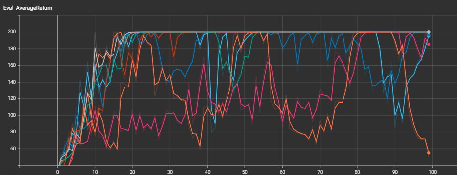
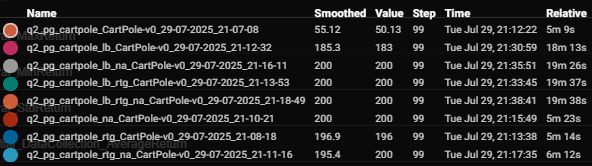

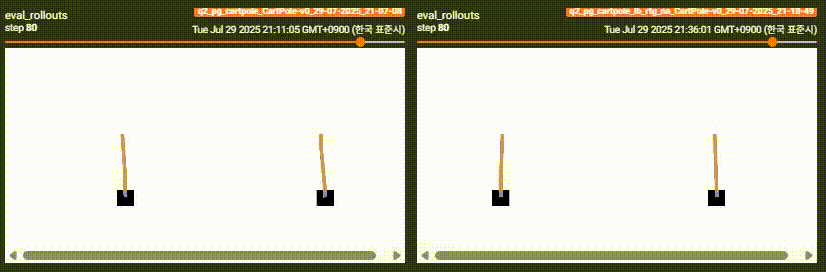


### 4  Using Neural Network Baseline

Command for problem 4 :

```
# No baseline
python cs285/scripts/run_hw2.py --env_name HalfCheetah-v4 \
-n 100 -b 5000 -rtg --discount 0.95 -lr 0.01 \
--exp_name cheetah
# Baseline
python cs285/scripts/run_hw2.py --env_name HalfCheetah-v4 \
-n 100 -b 5000 -rtg --discount 0.95 -lr 0.01 \
--use_baseline -blr 0.01 -bgs 5 --exp_name cheetah_baseline
```

Result of problem 4.1

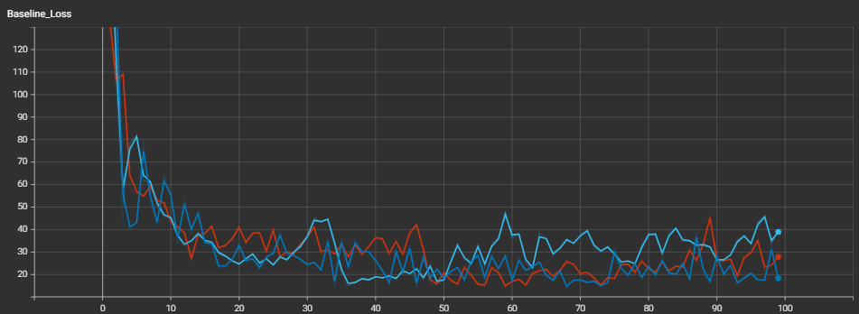

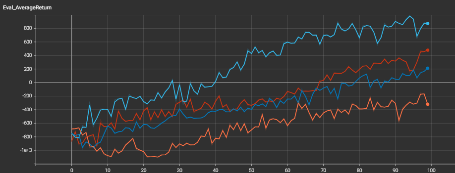

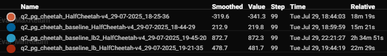

Result of problem 4.2 (decreasing bgs 5 to 2)

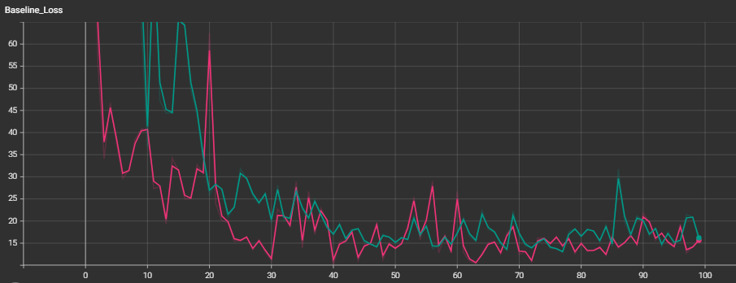

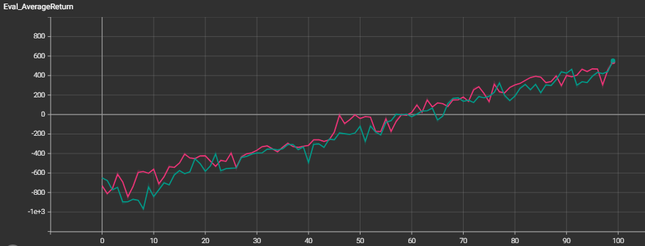

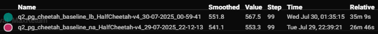


### 5 Implementing Generalized Advantage Estimation


Command for problem 5

```
python cs285/scripts/run_hw2.py \
--env_name LunarLander-v2 --ep_len 1000 \
--discount 0.99 -n 300 -l 3 -s 128 -b 2000 -lr 0.001 \
--use_reward_to_go --use_baseline --gae_lambda <ς> \
--exp_name lunar_lander_lambda<ς>
```


Result of problem 5 :

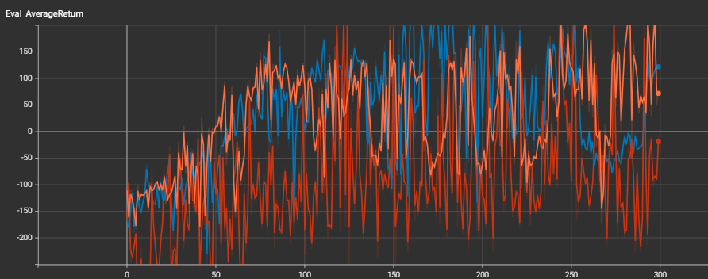


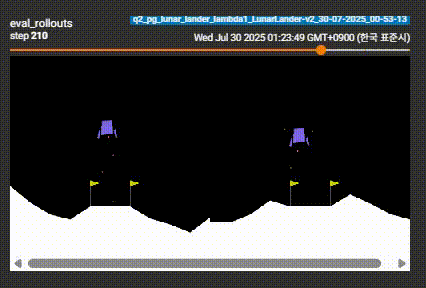


### 6 Hyperparameters and Sample Efficiency


Command for problem 6

```
for seed in $(seq 1 5); do
python cs285/scripts/run_hw2.py --env_name InvertedPendulum-v4 -n 100 \
--exp_name pendulum_default_s$seed \
-rtg --use_baseline -na \
--batch_size 5000 \
--seed $seed
done
```


Result of problem 6 :


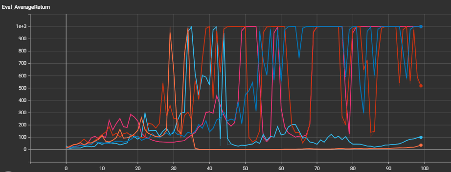


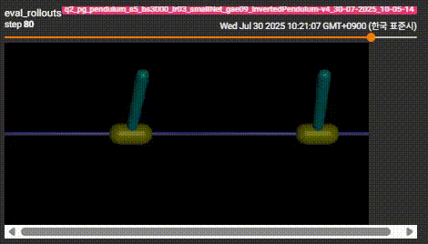

### 7 Extra Credit: Humanoid


Command for problem 7

```
python cs285/scripts/run_hw2.py \
--env_name Humanoid-v4 --ep_len 1000 \
--discount 0.99 -n 1000 -l 3 -s 256 -b 50000 -lr 0.001 \
--baseline_gradient_steps 50 \
-na --use_reward_to_go --use_baseline --gae_lambda 0.97 \
--exp_name humanoid --video_log_freq 5
```


Result of problem 7 :

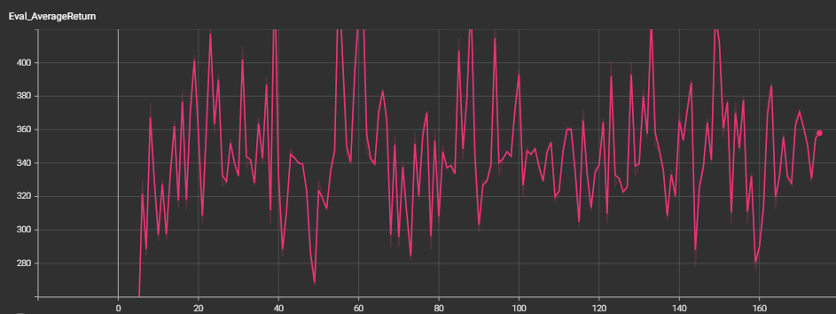


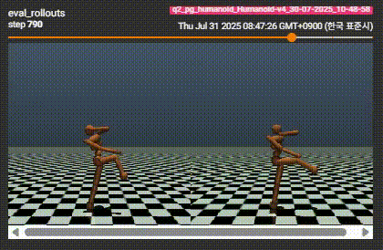


## Visualization the saved tensorboard event file:

You can visualize your runs using tensorboard:
```
tensorboard --logdir data
```


