# Run the code

## Note
- Implemented algorithms:
  - [x] Q-Learning
  - [x] Double Q-Learning
  - [x] Soft Actor-Critic (SAC)
  - [x] Clipped Double Q-Learning
  - [x] Randomized Ensembled Double Q-Learning (REDQ)


## 2 Deep Q-Learning

---
### Deliver 1: DQN on CartPole-v1

```
python cs285/scripts/run_hw3_dqn.py -cfg experiments/dqn/cartpole.yaml
```


Result 

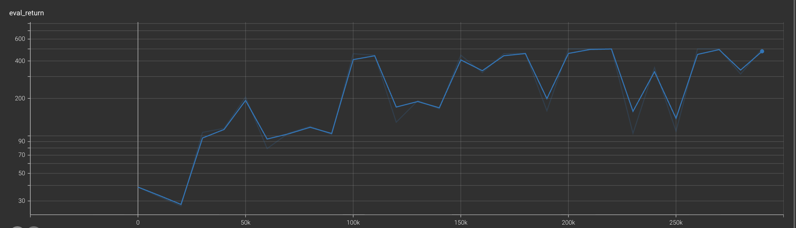


CartPole lr to 0.05

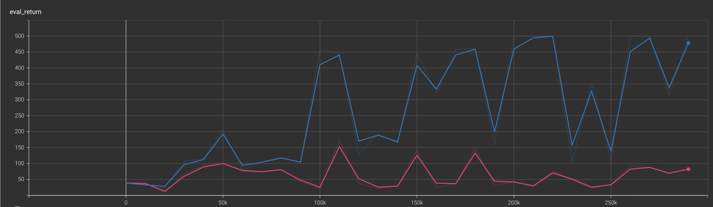


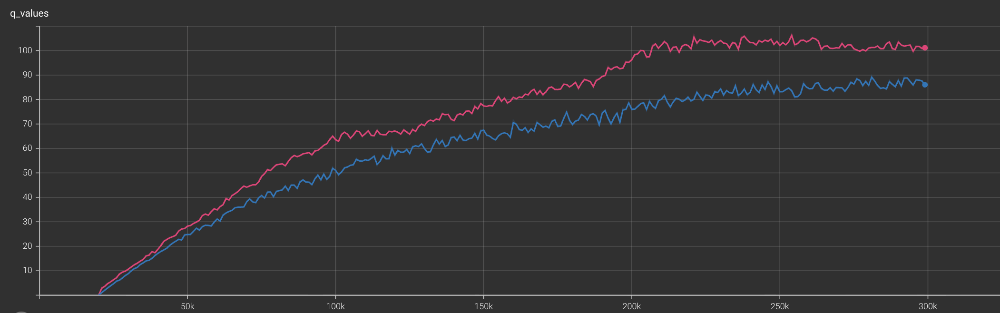

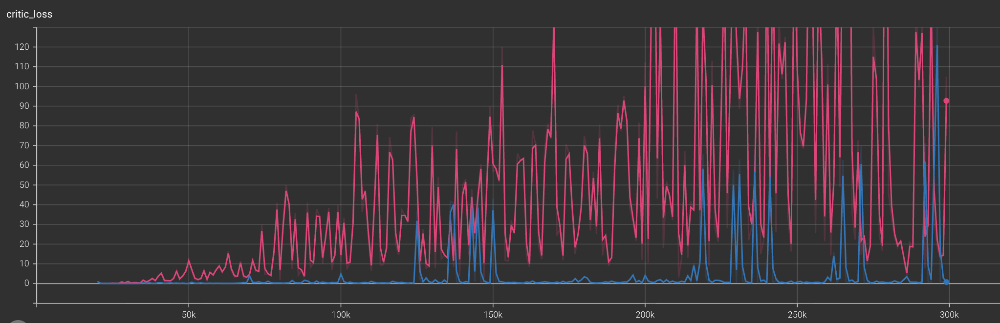

Run DQN on CartPole-v1, but change the learning rate to 0.05 (you can change this in the YAML config file). 
What happens to (a) the predicted Q-values, and (b) the critic error? Can you relate this to any topics from class or the analysis section of this homework?

(a) Effect on the predicted Q-values:

(b) Effect on the critic error:


### Deliver 2: DQN on LunarLander-v2

```
python cs285/scripts/run_hw3_dqn.py -cfg experiments/dqn/lunarlander.yaml --seed 1
python cs285/scripts/run_hw3_dqn.py -cfg experiments/dqn/lunarlander.yaml --seed 2
python cs285/scripts/run_hw3_dqn.py -cfg experiments/dqn/lunarlander.yaml --seed 3
```

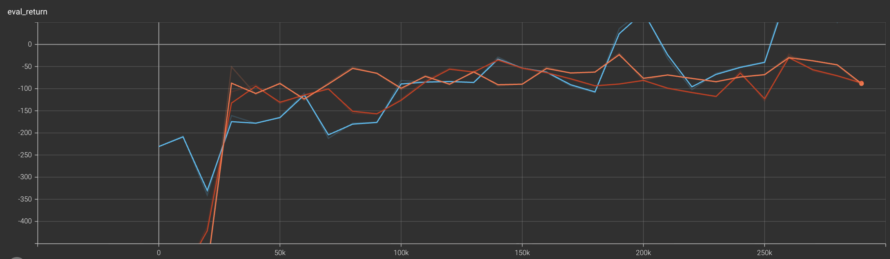

### Deliver 3: Double DQN on LunarLander-v2

```
python cs285/scripts/run_hw3_dqn.py -cfg experiments/dqn/lunarlander_doubleq.yaml --seed 1
python cs285/scripts/run_hw3_dqn.py -cfg experiments/dqn/lunarlander_doubleq.yaml --seed 2
python cs285/scripts/run_hw3_dqn.py -cfg experiments/dqn/lunarlander_doubleq.yaml --seed 3
```

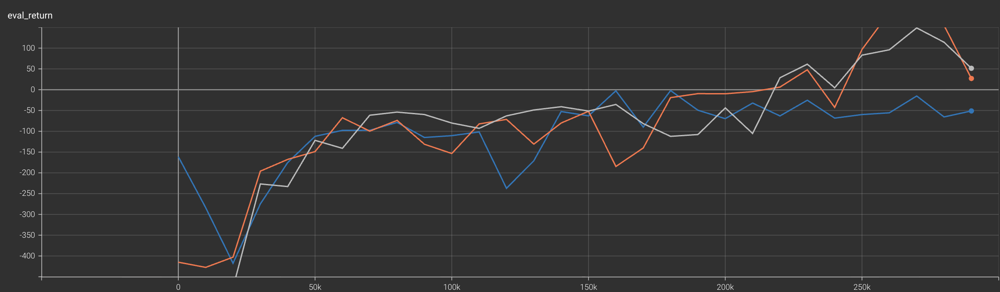

### Deliver 4: DQN implementation on the MsPacman-v0

```
python cs285/scripts/run_hw3_dqn.py -cfg experiments/dqn/mspacman.yaml
```

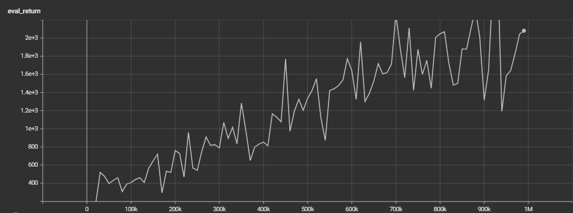

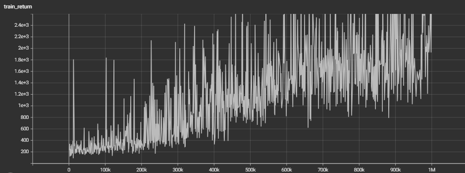


## 3 Continuous Actions with Actor-Critic

---


### Deliver 1: Actor with REINFORCE


```
python cs285/scripts/run_hw3_sac.py -cfg experiments/sac/sanity_invertedpendulum_reinforce.yaml
```

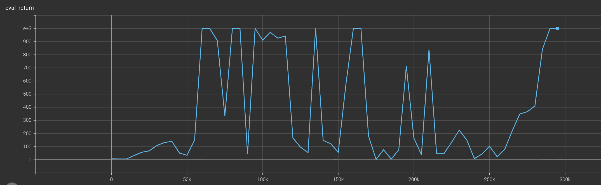


### Train an agent on HalfCheetah-v4
```
python cs285/scripts/run_hw3_sac.py -cfg experiments/sac/halfcheetah_reinforce1.yaml
python cs285/scripts/run_hw3_sac.py -cfg experiments/sac/halfcheetah_reinforce10.yaml
```


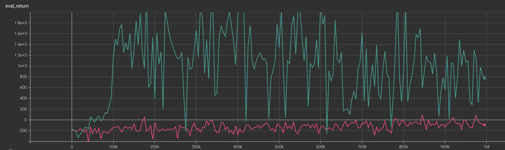


### Deliver 2: Actor with REPARAMETRIZE
```
python cs285/scripts/run_hw3_sac.py -cfg experiments/sac/halfcheetah_reparametrize.yaml
```


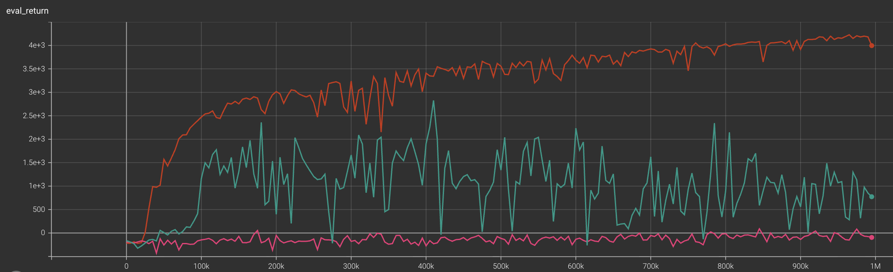


### Run single-Q, double-Q, and clipped double-Q on Hopper-v4
```
python cs285/scripts/run_hw3_sac.py -cfg experiments/sac/hopper.yaml
python cs285/scripts/run_hw3_sac.py -cfg experiments/sac/hopper_doubleq.yaml
python cs285/scripts/run_hw3_sac.py -cfg experiments/sac/hopper_clipq.yaml
```


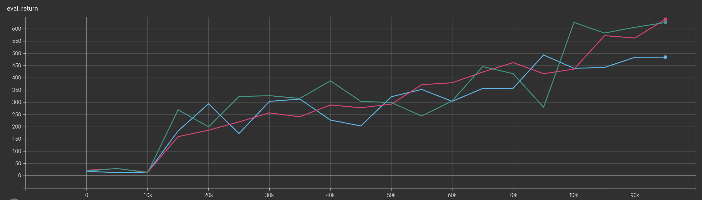

### Run Humanoid-v4
```
python cs285/scripts/run_hw3_sac.py -cfg experiments/sac/humanoid.yaml
python cs285/scripts/run_hw3_sac.py -cfg experiments/sac/humanoid_doubleq.yaml
python cs285/scripts/run_hw3_sac.py -cfg experiments/sac/humanoid_clipq.yaml
```


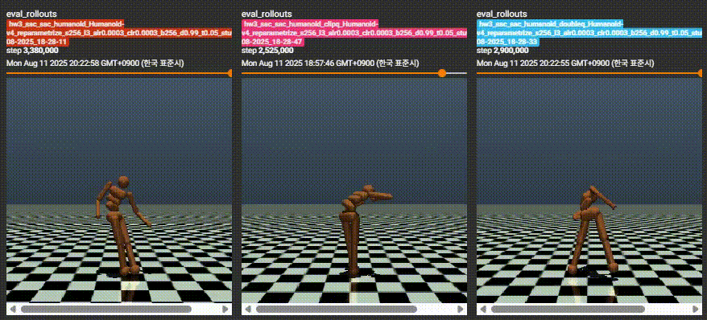

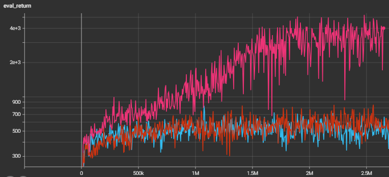
