# HW 4


## Note
- Implemented algorithms:
  - [x] Model Predictive Control (MPC)
  - [x] Cross-Entropy Method (CEM)
  - [x] Model-Based Policy Optimization (MBPO)


## Analysis

---
### Problem 2.1


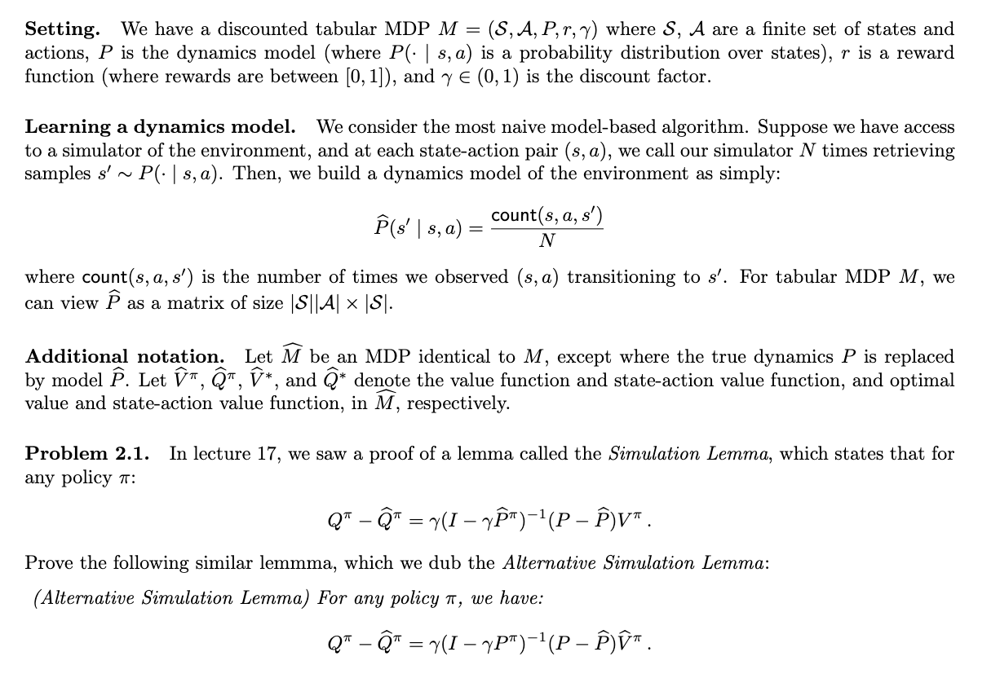
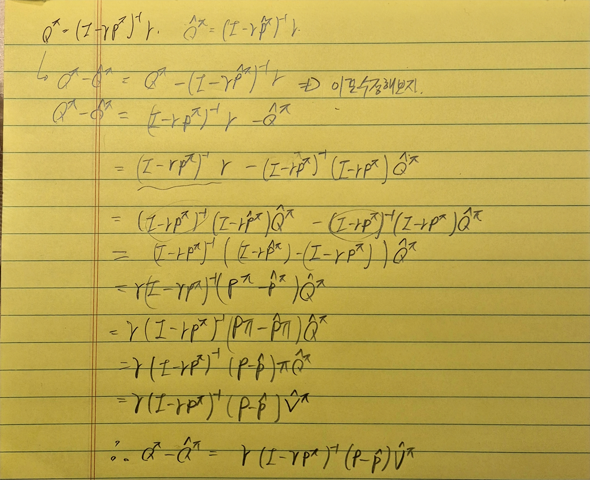

### Problem 2.2
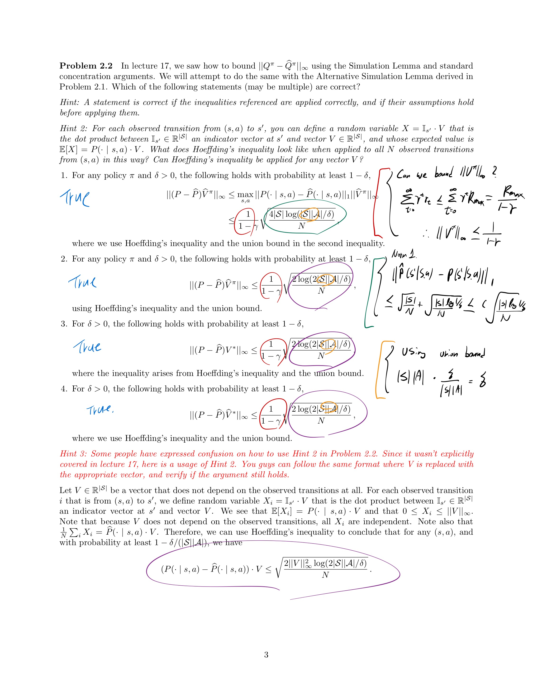

## Code

---
### Problem 1

```
python cs285/scripts/run_hw4.py -cfg experiments/mpc/halfcheetah_0_iter.yaml
```
experiments 1
num_layers: 1, hidden_size: 32

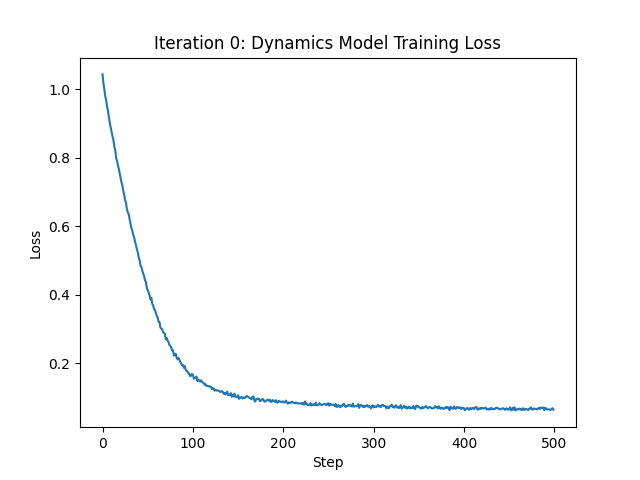

experiments 2
num_layers: 2, hidden_size: 64

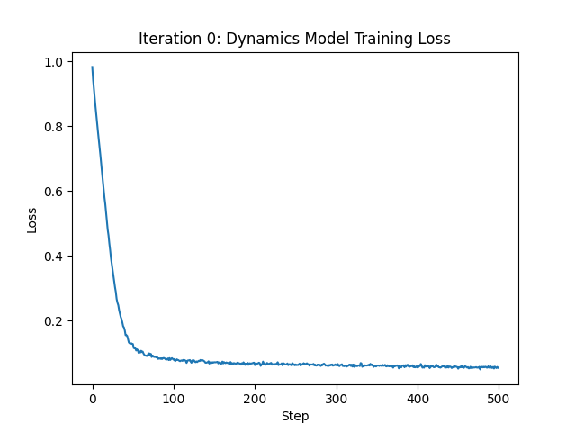

experiments 3
num_layers: 3, hidden_size: 128

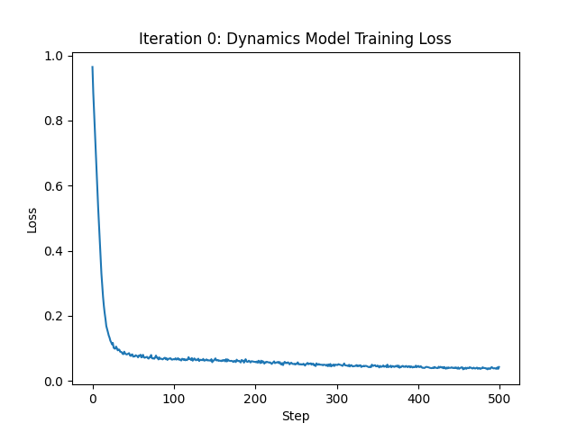


### Problem 2
```
python cs285/scripts/run_hw4.py -cfg experiments/mpc/obstacles_1_iter.yaml
```
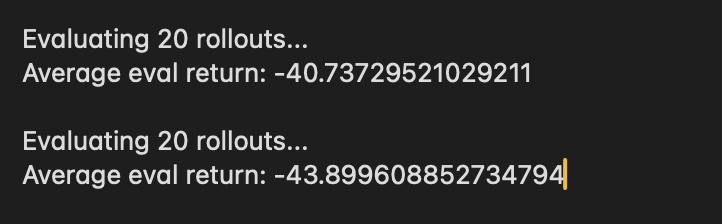


### Problem 3
Experiment 1
```
python cs285/scripts/run_hw4.py -cfg experiments/mpc/obstacles_multi_iter.yaml
```


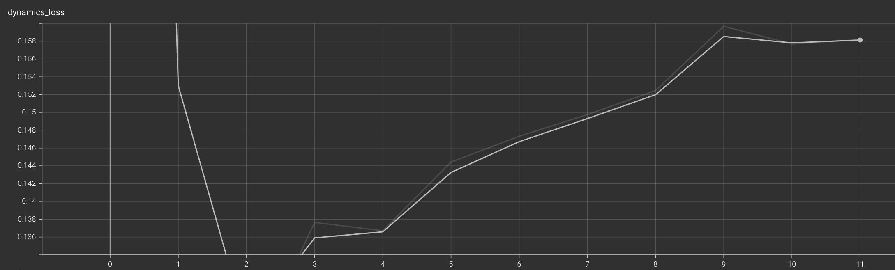
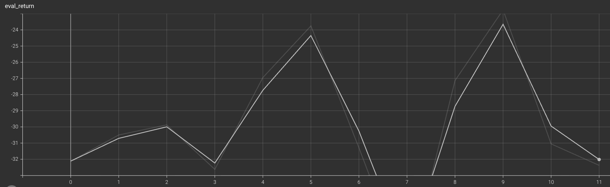

Experiment 2
```
python cs285/scripts/run_hw4.py -cfg experiments/mpc/reacher_multi_iter.yaml
```


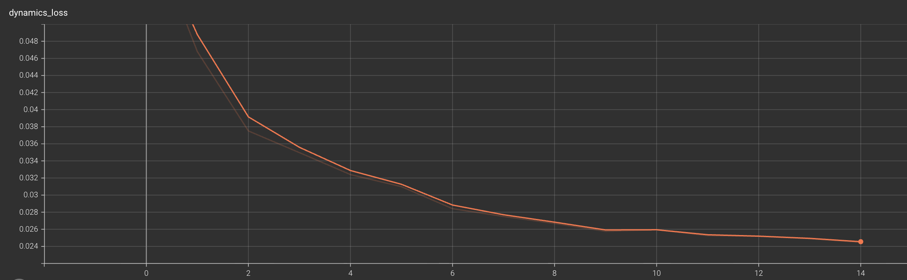
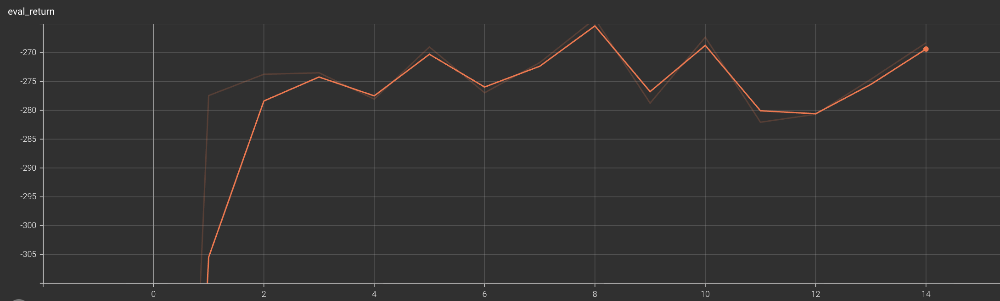

Experiment 3
```
python cs285/scripts/run_hw4.py -cfg experiments/mpc/halfcheetah_multi_iter.yaml
```


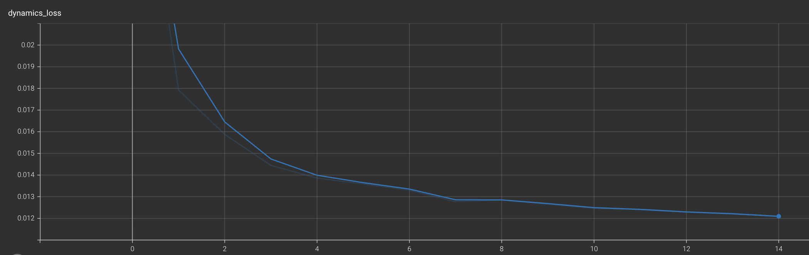
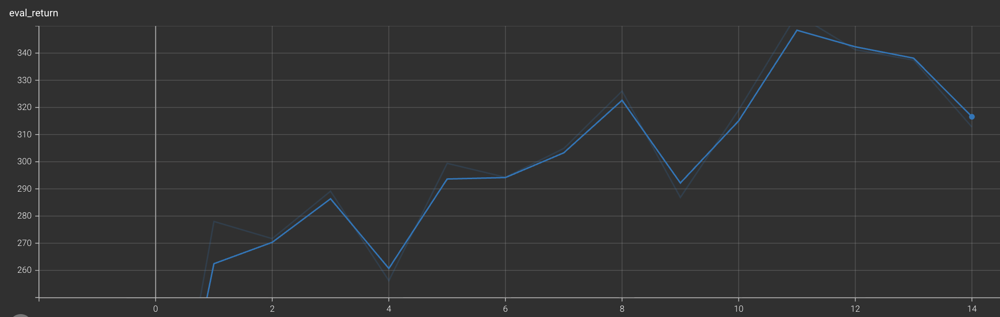

### Problem 4

```
python cs285/scripts/run_hw4.py -cfg experiments/mpc/reacher_ablation.yaml
```
Effect of the number of candidate action sequences


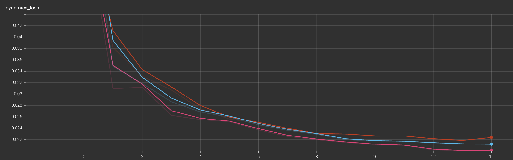
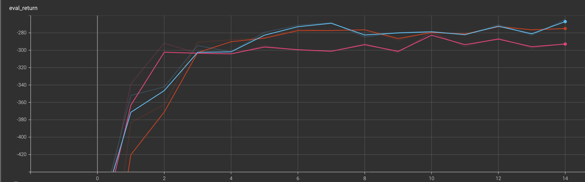

**observed trends :** A larger number of action sequences generally improves performance by increasing the chance of finding a good plan.

Effect of planning horizon


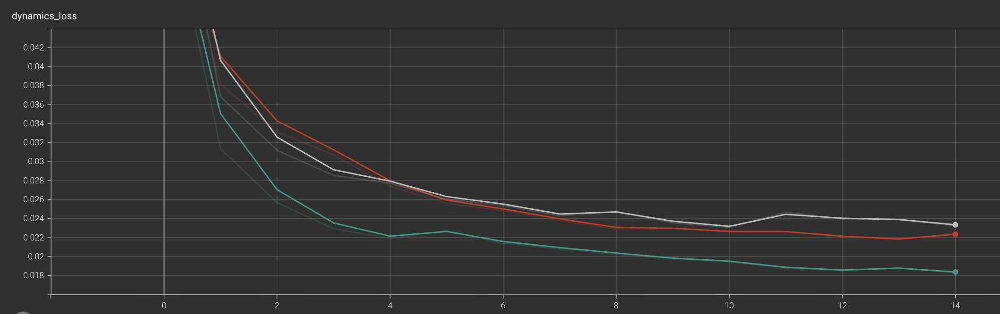
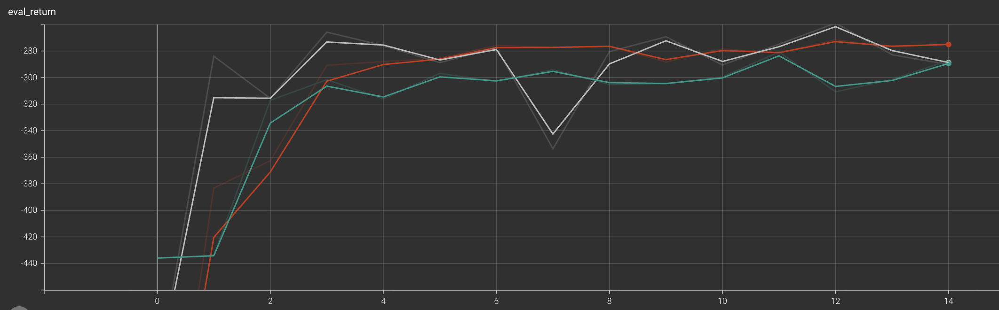

**observed trends :** The ideal planning horizon is a trade-off: it must be long enough to capture meaningful rewards but short enough to avoid cumulative prediction errors.


Effect of ensemble size


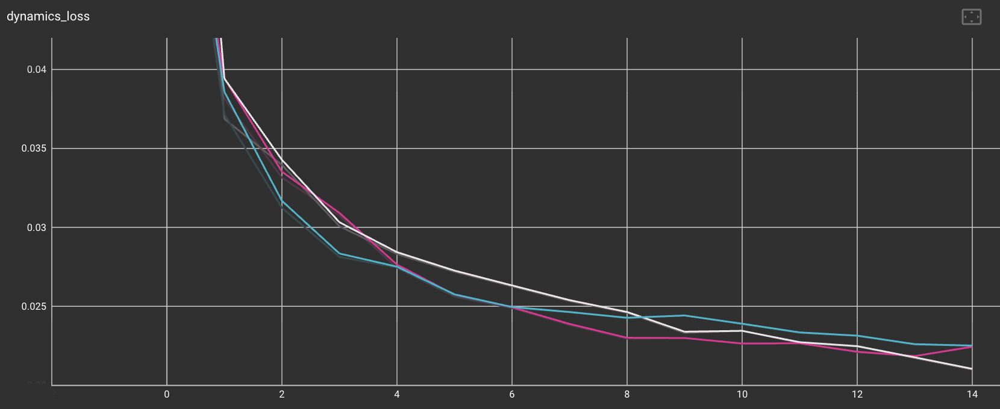
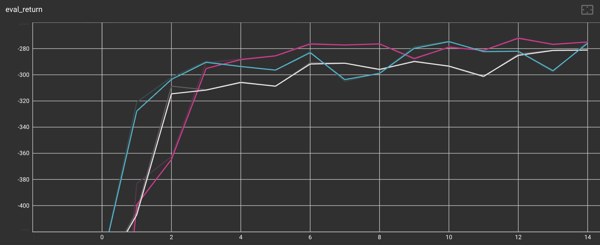

**observed trends :** “The reward was higher with ensemble sizes of 3 or 5 compared to a single model, but beyond 3 ensembles, additional models did not provide significant benefits.”

### Problem 5

```
python cs285/scripts/run_hw4.py -cfg experiments/mpc/halfcheetah_cem.yaml
```
Effect of CEM iteration


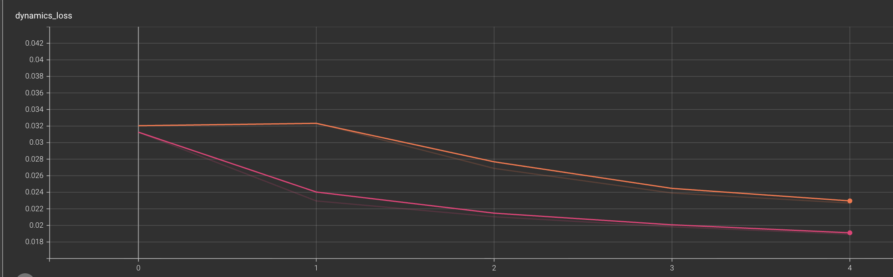
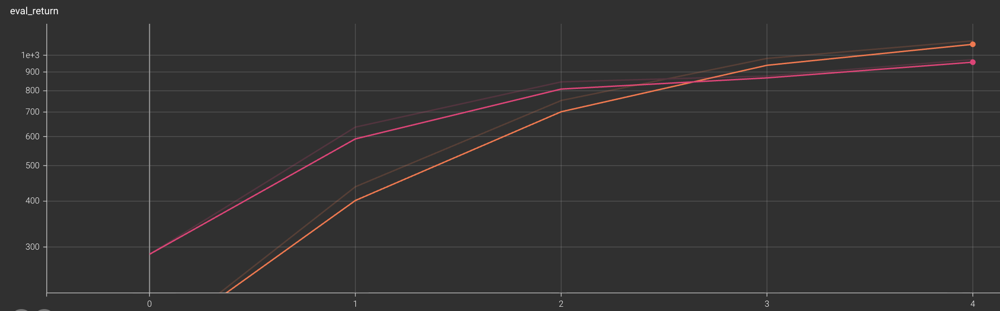

**observed trends :**  Increasing the number of CEM iterations from 2 to 4 improves performance because the algorithm has more opportunities to refine the action distribution. Each additional iteration allows the model to select a more elite set of candidates, leading to a more precisely focused distribution for subsequent sampling and ultimately a better plan.


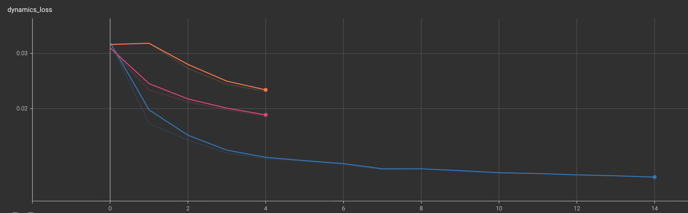
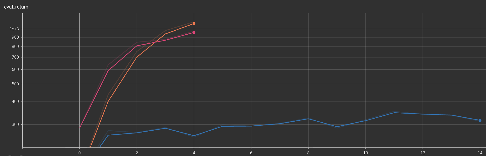

**observed trends :**  CEM is superior to random shooting because it iteratively refines the search space, allowing it to focus on areas with a higher density of good actions rather than searching randomly across the entire action space.

### Problem 6

```
python cs285/scripts/run_hw4.py -cfg experiments/mpc/halfcheetah_mbpo.yaml --sac_config_file experiments/sac/halfcheetah_clipq.yaml
```
Effect of MBPO rollout length


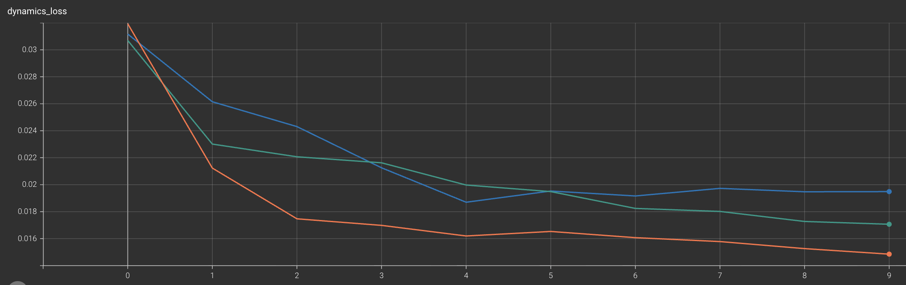
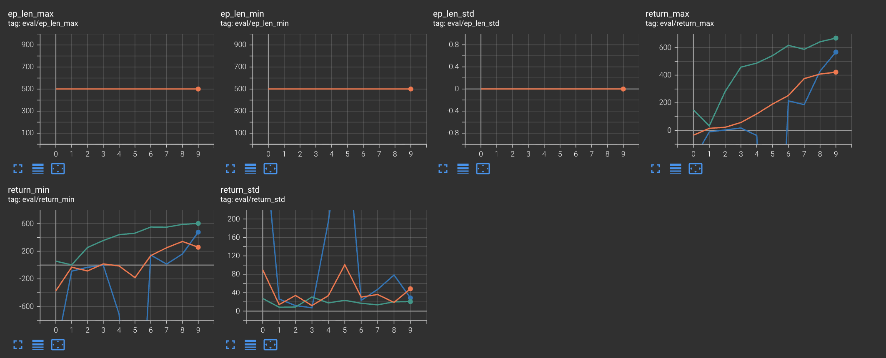
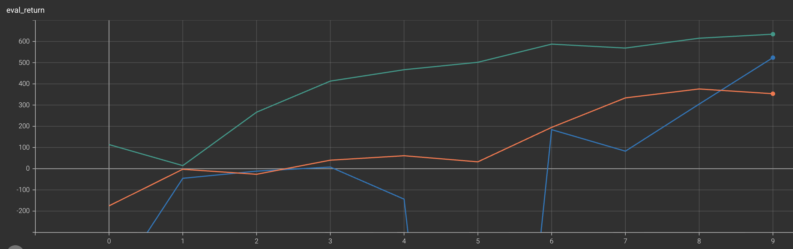

**observed trends :**  The advantage of a longer rollout length is that it increases the amount of model-generated data, leading to a more stable and accurate actor and critic. 
